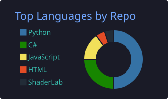
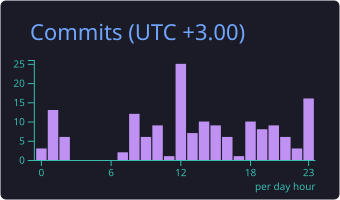
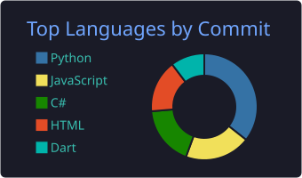

<p align="center">
  
</p>

<p align="center">
  <a href="https://linkedin.com/in/bugrayalcin8"></a>
  <a href="mailto:bugrayalcn1@gmail.com"></a>
  
</p>

```console
$ cat about.txt
sensörden modele, modelden arayüze — zincirin tamamını kurarım.
şu an: dengesiz veri setlerinde çok amaçlı hiperparametre optimizasyonu.
hedef: savunma sanayi ve otonom sistemler.
```

<p align="center">
  
</p>

<br>

### Projeler

**`can-bağı`**  ·  ESP32 mesh ağ ile altyapısız afet haberleşmesi
<sub>painlessMesh · FastAPI · React/Flutter — 🥇 EBST Hackathon 2026</sub> · [repo](https://github.com/k0laa/can_bagi)

**`mo-hpo`**  ·  sınıf dengesizliğini yeniden örnekleme yerine arama uzayı problemi olarak çözer
<sub>NSGA-II · Optuna · LightGBM — CICIDS2017'de macro-F1 0.67 → 0.89</sub>

**`obs-bot`**  ·  not değişince telegram'a düşer
<sub>CAPTCHA OCR · JSON diff · GitHub Actions, 30 dk cron</sub>

**`yankı`**  ·  sonarla görülen birinci şahıs korku oyunu
<sub>raycast şematik görüş · URP karanlık shader — 🥈 BANÜ Game Jam</sub>

<br>

### Aktivite

<p align="center">
  
  
</p>
<p align="center">
  
  
</p>
